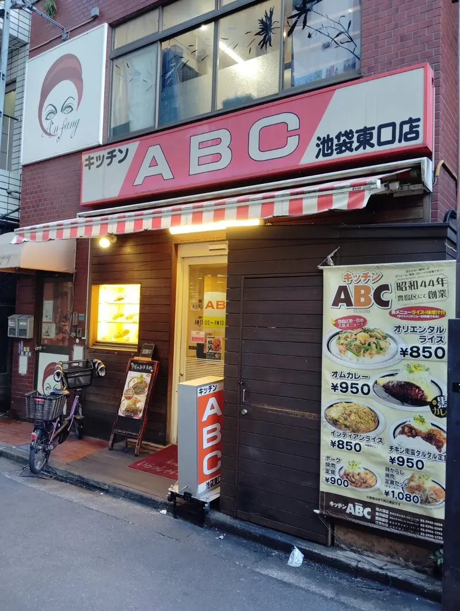
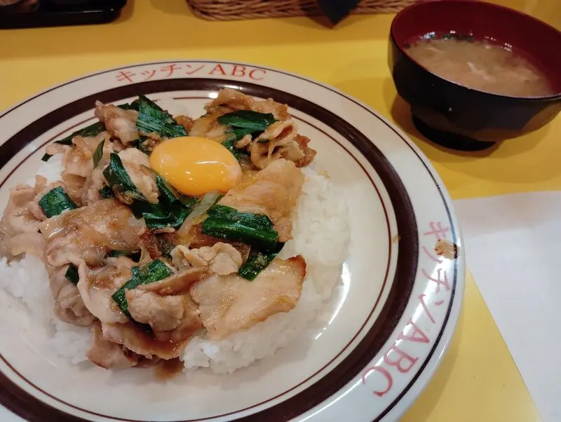

#+HUGO_BASE_DIR: ~/repo/dandieat
#+date: <2026-02-09 Mon>
#+title:昭和のスタミナ丼？いえプレートのオリエンタルライスを食べる！ABCキッチン池袋東口店
#+HUGO_CATEGORIES: グルメ
#+HUGO_TAGS: 池袋

池袋の洋食屋、キッチンABCでオリエンタルライスを食べました. 

池袋ジュンク堂の隣の細い道を挿んだ向かいにあります. この道はよく通過するものの、いつも行列ができていて素通りしていましたが、今回たまたま平日昼間の時間帯に通ったら空いていたのでチャンス！と思って飛び込みました. 

人気店のお昼どきだけあって、若い店員さんがおおくて活気がある. 定番メニューのオリエンタルライスを注文. お腹ぺこぺこだったので、大盛！

ライスの上に豚肉とニラ、そして卵が乗っている. これはまるで、すた丼だ！しかし、丼ではなく平らなお皿というのがほっこりする. さらなるほっこりポイントは、みそ汁. これは豚汁だ. 秘伝のタレということで、スタミナがつきそうなにんにくは入っていそうではあるが、そこまでしつこい味ではない. 

昭和創業というのは、とても強いブランド力だと思った. わたしも昭和の生まれでずっと西武池袋線ユーザだったので、昔から池袋は知っているが、古いお店があると、ついつい足を止めて寄り道したくなってしまう. これからも続いてほしいと思った. 

* Refs

- [[https://tf-abc.co.jp/][【公式】キッチンABC｜昭和44年創業の老舗洋食屋 | 豊島区を中心に池袋西口店、池袋東口店、南大塚店、江古田店の4店舗展開しております。]]
- [[https://tabelog.com/tokyo/A1305/A130501/13130238/][キッチンABC 池袋東口店 （キッチン エービーシー） - 池袋/洋食 | 食べログ]]

* 本日のメニュー

- オリエンタルライス: 850円+300円(大盛)
